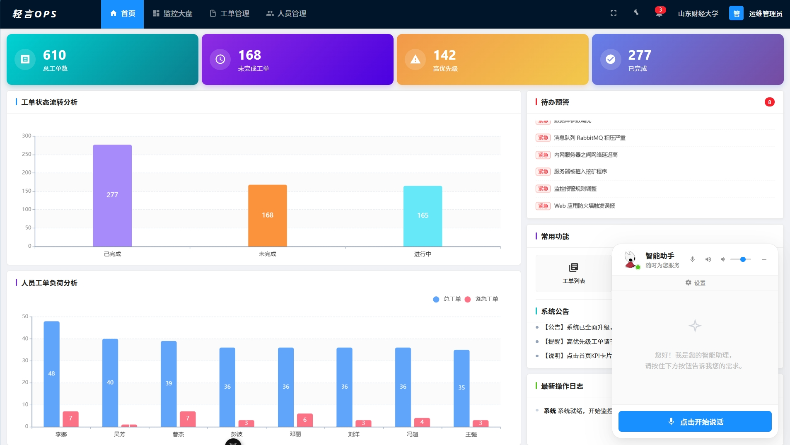
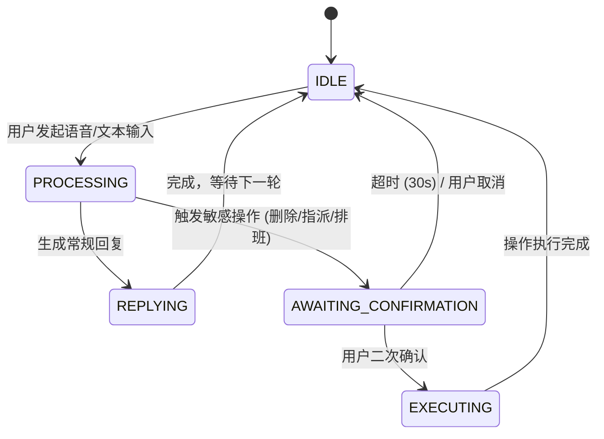

***

# 🚀 轻言OPS — 基于大模型驱动的数字人智能助手


> 运维工单管理 + 语音交互 + 3D 可视化监控大屏，一站式智能运维平台。

**GitHub 仓库**：<https://github.com/YANJI-AFK/qingyan-OPS>

***

## ✨ 项目简介

轻言OPS 是一个基于大语言模型（Ollama + Qwen3）的智能运维助手，核心能力包括：

| 模块           | 核心能力说明                                 |
| ------------ | -------------------------------------- |
| 🎙️ **语音对话** | 支持语音输入/输出，通过 FunASR 识别 + TTS 合成实现自然交互。 |
| 🧠 **意图识别**  | 基于 LLM 的意图解析，支持导航、查询、搜索、排班、操作等 11 类意图。 |
| 🎫 **工单管理**  | 涵盖工单 CRUD、多条件搜索、SLA 超时预警、状态流转、指派与删除。   |
| 📅 **排班管理**  | 提供日历排班、快速排班、批量修改功能，并支持语音排班（需二次确认）。     |
| 👥 **人员管理**  | 包含人员档案、岗位角色配置以及角色标签管理。                 |
| 🌍 **监控大屏**  | 集成 3D 地球、实时 KPI、拓扑图、饼图与时序折线图，实现数据动态更新。 |
| 📊 **统计看板**  | 可视化工单趋势、状态分布、人员负荷与 SLA 分析。             |
| ⚙️ **参数配置**  | 支持 SLA 阈值、工单规则、通知推送、权限控制与数据导出等可配置项。    |

***

###   系统主页展示

## 🏗️ 技术架构

| 分层       | 技术选型                                             |
| -------- | ------------------------------------------------ |
| **后端**   | Python 3.12+ / Flask 3.1 / pyodbc                |
| **前端**   | Vue 3 + TypeScript + Vite / Pinia / ECharts 6    |
| **数据库**  | SQL Server 2019+ / ODBC Driver 17 / `OpsCenter`  |
| **大模型**  | Ollama + `qwen3:8b`（本地推理，temperature=0.1）        |
| **语音**   | FunASR（`paraformer-zh` 离线识别）/ sherpa-onnx VITS / SAPI / edge-tts |
| **音频处理** | ffmpeg（WebM → WAV 16kHz 单声道）                     |

***

## ⚙️ 环境要求

| 组件              | 版本要求              | 补充说明                           |
| --------------- | ----------------- | ------------------------------ |
| **Python**      | 3.12+             | 推荐使用 3.12 版本。                  |
| **Node.js**     | 22.18+ / 24.12+   | 前端运行时环境。                       |
| **SQL Server**  | 2019+             | 支持本地或远程部署。                     |
| **ODBC Driver** | 17 for SQL Server | 用于建立数据库连接驱动。                   |
| **Ollama**      | 最新版               | 提供本地 LLM 推理服务。                 |
| **ffmpeg**      | 最新稳定版             | 用于音频格式转换（FunASR 的必要依赖）。        |
| **操作系统**        | Windows 10/11     | 当前仅支持 Windows（因为 TTS 依赖 SAPI）。 |

***

## 🚀 快速启动

### 从 GitHub 获取项目

```powershell
git clone https://github.com/YANJI-AFK/qingyan-OPS.git
cd qingyan-OPS
```

### 前期准备：分 3 步完成（共 6 项）

> 顺序很重要：**先安装软件 → 再配置系统 PATH → 最后准备数据库**，全部完成后才能双击 `startup.bat`。
> 因为 `startup.bat` 启动时会用 `where python / node / ollama` 检测命令，**软件装了但没配置 PATH 会直接报错退出**。

**① 安装软件**

| 序号 | 需要安装       | 版本要求            | 说明                                     |
| -- | ---------- | --------------- | -------------------------------------- |
| 1  | Python     | 3.12+           | 安装时勾选 "Add Python to PATH"             |
| 2  | Node.js    | 22.18+ / 24.12+ | 安装时默认自动加入 PATH                         |
| 3  | Ollama     | 最新版             | 从 <https://ollama.com> 下载安装，启动后保持运行    |
| 4  | SQL Server | 2019+           | 含 **ODBC Driver 17 for SQL Server** 驱动 |
| 5  | ffmpeg     | 最新稳定版           | 解压到如 `C:\ffmpeg`（FunASR 必需）            |

**② 配置系统 PATH**

| 需要配置    | 配置方法                            |
| ------- | ------------------------------- |
| Python  | 安装时勾选即自动配置；未勾选则手动把安装目录加入系统 PATH |
| Node.js | 安装时默认自动配置                       |
| ffmpeg  | 手动把 `C:\ffmpeg\bin` 目录加入系统 PATH |

配置后**重开命令行**验证是否生效：

```powershell
python --version
node --version
ffmpeg -version
```

**③ 准备数据库**

| 序号 | 需要准备 | 说明                                                              |
| -- | ---- | --------------------------------------------------------------- |
| 6  | 登录用户 | SQL Server 中创建 `ai_ops_user`（密码 `Ops1234`），授予 `OpsCenter` 库访问权限 |
| 7  | 备份文件 | 将 `OpsCenter.bak` 放到项目根目录                                       |

### 启动方式：双击 `startup.bat`

在项目根目录**双击** **`startup.bat`**，脚本会自动完成以下 10 个步骤：

| 步骤      | 自动完成的内容                                           |
| ------  | ------------------------------------------------- |
| \[1/10] | 检查 Python 环境                                      |
| \[2/10] | 创建虚拟环境 `venv`（如已存在则跳过）                            |
| \[3/10] | 安装后端 Python 依赖（`pip install -r requirements.txt`） |
| \[4/10] | 检查/下载 sherpa-onnx 离线 TTS 模型（约 115MB，已存在则跳过；失败自动降级 SAPI） |
| \[5/10] | 检查 Node.js 环境                                     |
| \[6/10] | 安装前端依赖（`npm install`，如已存在则跳过）                     |
| \[7/10] | 检查 Ollama 服务                                      |
| \[8/10] | 检查并自动拉取模型 `qwen3:8b`（如已存在则跳过）                     |
| \[9/10] | 测试模型连通性                                           |
| \[10/10] | 检查数据库：有数据则跳过，不可连接则自动从 `OpsCenter.bak` 还原          |

> 全部通过后自动启动前端（`http://localhost:5173`）和后端（`http://localhost:5000`）。关闭窗口即可停止服务。

> 💡 若还原数据库提示权限不足，可用 SSMS 手动还原，或修改 `_db_setup.py` 中的连接账号密码。

## 🚀手动启动

### 1. 创建 Python 虚拟环境

```powershell
cd "F:\基于大模型驱动的数字人智能助手"
python -m venv venv

```

### 2. 安装后端依赖

进入虚拟环境并安装核心包与可选包：

```powershell
venv\Scripts\activate
cd backend
pip install -r requirements.txt
pip install pywin32  # 推荐安装以获得 SAPI 语音支持（离线）
```

- 后端核心依赖包含：`flask`, `flask-cors` (Web 框架)。
- `requests` (调用 Ollama), `pyodbc` (SQL Server 连接)。
- `funasr`, `modelscope` (离线语音识别)。
- `soundfile`, `pyaudio` (音频处理与采集)。
- `sherpa-onnx`, `numpy` (离线神经网络 TTS，音质最佳)。
- `pyttsx3`, `pywin32` (SAPI 语音合成兜底，离线)。
- `edge-tts` (在线 TTS，可选，设置 `TTS_MODE=auto` 后启用)。

### 3. 下载 sherpa-onnx 离线语音模型（可选但推荐）

默认的离线神经网络 TTS 需要约 115MB 的 VITS 中文模型（含 5 个音色）。**模型必须放在英文路径**（kaldifst 引擎不支持中文路径）：

```powershell
# 1. 创建英文路径模型目录
mkdir C:\sherpa-tts

# 2. 下载模型（GitHub 下载，可能需要代理）
curl -L -o C:\sherpa-tts\sherpa-onnx-vits-zh-ll.tar.bz2 ^
  https://github.com/k2-fsa/sherpa-onnx/releases/download/tts-models/sherpa-onnx-vits-zh-ll.tar.bz2

# 3. 解压
tar -xf C:\sherpa-tts\sherpa-onnx-vits-zh-ll.tar.bz2 -C C:\sherpa-tts
```

> 模型目录可通过环境变量 `SHERPA_TTS_DIR` 覆盖（默认 `C:\sherpa-tts\sherpa-onnx-vits-zh-ll`）。
> 未下载模型时，系统自动降级为 Windows SAPI 语音（离线兜底）。

### 4. 配置 SQL Server 数据库

- 创建登录用户 `ai_ops_user`，设置密码为 `Ops1234`，并授予其对 `OpsCenter` 数据库的访问权限。
- 使用 SQL Server Management Studio（SSMS）还原数据库备份：右键「数据库」→「还原数据库」，选择提供的 `OpsCenter.bak` 备份文件完成还原。
- 修改 `backend/db_service.py` 中的连接配置（第 26-34 行）。
- 数据库还原完成后即可正常使用，无需手动执行建表和种子数据脚本。

### 5. 安装 Ollama 并拉取模型

安装 Ollama 后，拉取所需模型（默认配置为 `qwen3:8b`，见 `backend/ollama_service.py` 第 9-10 行）：

```powershell
ollama pull qwen3:8b
```

### 5. 安装前端依赖

```powershell
cd frontend
npm install
```

### 7. 启动服务

需分别在两个终端中启动前端与后端：

- **启动后端**：`cd backend` -> 激活虚拟环境 -> 运行 `python app.py`。
- **启动前端**：`cd frontend` -> 运行 `npm run dev`（默认访问 `http://localhost:5173`）。
- **TTS 模式**：默认 `TTS_MODE=offline`（全离线，使用 sherpa-onnx / SAPI，无需设置）；如需启用在线 edge-tts 音色，启动后端前执行 `$env:TTS_MODE = "auto"`。

***

## 📂 项目结构

项目采用清晰的前后端分离目录结构：

```text
基于大模型驱动的数字人智能助手/
├── startup.bat                    # 一键启动脚本（环境检查 + 依赖安装 + 启动前后端）
├── _db_setup.py                   # 数据库检查与自动还原工具（startup.bat 调用）
├── _install_windows_tts.bat       # Windows 中文语音包安装脚本（需管理员运行，可选）
├── OpsCenter.bak                  # 数据库备份文件（还原数据库用）
├── readme.md / AGENTS.md          # 使用文档 / 编码指南
├── SYSTEM_FEATURES.md             # 系统功能特性说明
├── images/                        # 文档截图资源
├── archive/                       # 归档区
│   ├── docs/                      #   ├── 项目文档（WEEK 周报、需求修改等）
│   └── data/                      #   └── 旧 Mock 数据（servers.txt、tickets.txt）
├── logs/                          # 运行日志（stdout.log、stderr.log，gitignore 忽略）
├── backend/                       # 后端服务（Flask，端口 5000）
│   ├── app.py                     # 路由 + 状态机 + 意图执行引擎
│   ├── ollama_service.py          # LLM 调用 + 意图解析 + 结果润色
│   ├── asr_service.py             # FunASR 离线语音识别
│   ├── tts_service.py             # TTS 合成（sherpa / SAPI / edge-tts 三引擎）
│   ├── db_service.py              # 数据库连接池 + 全部 CRUD
│   ├── chat_state.py              # 对话状态机（FSM）
│   ├── tts_models/                # sherpa-onnx 模型缓存目录
│   ├── requirements.txt           # Python 依赖清单
│   └── tests/                     # 后端测试脚本与测试用例文档
├── frontend/                      # 前端应用（Vite，端口 5173）
│   ├── index.html                 # 入口 HTML
│   ├── package.json               # 前端依赖清单
│   └── src/
│       ├── App.vue                # 根组件（数字人浮窗 + VAD 持续聆听）
│       ├── router/                # 路由（8 页面 + 2 子布局）
│       ├── views/                 # 业务页面（Home/Monitor/Tickets/Staff 等 10 个）
│       └── components/            # 3D 地球等公共组件
└── docs/
    └── PROMPT.md                  # LLM Prompt 设计文档
```

***

## 🛣️ 页面路由

| 路由                | 关联组件           | 页面名称   |
| :---------------- | :------------- | :----- |
| `/`               | HomePage       | 首页     |
| `/tickets`        | TicketsPage    | 工单列表   |
| `/tickets/stats`  | StatsPage      | 工单统计看板 |
| `/tickets/config` | ConfigPage     | 工单参数配置 |
| `/monitor`        | MonitorPage    | 监控大屏   |
| `/staff`          | StaffListPage  | 人员管理   |
| `/staff/schedule` | SchedulePage   | 排班管理   |
| `/staff/roles`    | RoleConfigPage | 岗位角色配置 |

***

## 🔌 API 接口一览

系统提供了丰富的 HTTP API，涵盖以下核心模块：

- **💬 对话与语音**：提供 `/chat` (意图执行)、`/api/transcribe` (语音转文字)、`/api/tts` (文字转语音) 以及状态机重置与调试接口。
- **🎫 工单管理**：支持工单的 CRUD 操作 (`/api/tickets/*`)，并包含流转历史查询、可指派人员列表以及多条件搜索。
- **📈 监控与统计**：包含 `/api/servers/metrics` (最新监控指标) 及其历史数据查询，提供 `/api/stats/dashboard` 看板聚合数据。
- **👥 人员与排班**：提供人员增删改查 (`/api/staff/*`)、排班分配及批量修改，同时支持角色 (`/api/staff/roles`) 与标签配置。
- **⚙️ 系统配置**：通过 `/api/config/params` 获取与更新系统参数。

***

## 🧠 大模型提示词说明

系统利用 Ollama + Qwen3 8B 模型，通过三层 Prompt 设计完成复杂的业务逻辑：

**1.意图解析 System Prompt**

- 将用户自然语言解析为包含 `intent`、`api`、`params` 的 JSON 结构。
- 预设支持 11 类意图（如导航 `navigate`、操作 `operate`、多条件搜索 `search` 等）。
- 支持上下文连续问答，并能将中文日期自动转换为标准格式（如 `2026-07-27`）。

**2.数据润色 Prompt**

- 要求 LLM 基于统计数据输出自然、简洁的中文一句话回复，避免废话套话。

**3.搜索结果润色 Prompt**

- 针对多条件搜索，强制要求明确告知命中的条数、筛选条件以及前 1-3 条最相关的工单信息，严禁编造数据。

***

## 🎙️ 语音交互

系统实现了全链路的语音交互能力：

- **ASR 语音识别**：基于阿里达摩院的 FunASR（`paraformer-zh` 模型），实现完全离线的中文识别；前端上传 WebM 音频，后端经 ffmpeg 转 WAV 处理。
- **TTS 语音合成**：三引擎方案，**默认全离线**：
  - `sherpa-onnx VITS`（离线神经网络，音质最佳，5 个中文音色，模型需下载）
  - `Windows SAPI`（系统自带，离线兜底，自动枚举已安装语音）
  - `edge-tts`（微软神经网络，在线，设置 `TTS_MODE=auto` 后可选）
  - 支持多音色切换与 0.5x - 2.0x 语速调节。
- **交互模式**：

      1.手动录音：点击控制录音，过程实时显示文字转写。

      2.连续聆听：通过 VAD 自动检测语音，静音 1.8 秒后自动结束识别。

***

## 🔄 对话状态机

为保障执行安全性，后端的 `chat_state.py` 使用有限状态机管理对话与二次确认流程。



- **敏感操作拦截**：删除工单、指派工单、修改状态与排班默认需二次确认，可在配置页的"权限与操作门槛"中关闭。
- **超时释放**：确认状态超时时间为 30 秒，超时后自动取消。

***

## 🗄️ 数据库设计

基于 SQL Server 设计的核心数据表与连接池配置：

- **核心表结构**（按业务域划分）：
  - **工单域**：工单表 (`tickets`)、工单历史表 (`ticket_history`)
  - **人员域**：人员档案 (`staff`)、排班信息 (`staff_schedule`)
  - **标签域**：角色表 (`staff_roles`)、角色标签 (`role_tags`)、角色-标签关联表 (`role_tag_rel`，多对多)、员工-标签关联表 (`staff_tags`，多对多)
  - **监控域**：监控指标快照 (`metrics_snapshots`)
  - **系统域**：系统配置 (`sys_config`)
- **连接池性能**：固定 7个连接（`POOL_SIZE = 7`），具备连接失败自动重试 3 次及请求后自动归还机制。

***

## 🧪 测试用例

项目提供了完善的文档支持：

- `模型完整测试用例.md`：覆盖意图识别与参数提取。
- `语音交互完整测试用例.md`：包含 62 个用例的端到端测试。
- `工单参数配置新增卡片测试用例.md`：覆盖新增的配置卡片功能。

***

## ❓ 常见问题

- **报错未激活虚拟环境**：必须在项目根目录执行 `venv\Scripts\activate` 才能启动 Flask。
- **FunASR 模型加载失败**：初次运行需下载约 1GB 的离线模型，请确保网络通畅。
- **地球纹理不显示**：检查 `frontend/public/world_map.jpg` 文件是否存在。
- **语音模块不工作**：请校验麦克风权限，并确认 `ffmpeg` 已正确安装并加入系统 PATH。
- **数据库连接失败**：需确认 SQL Server 服务正常运行，ODBC Driver 17 已安装，且防火墙未拦截 1433 端口。

